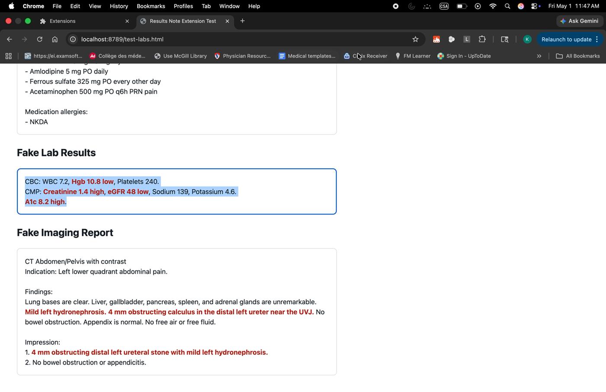
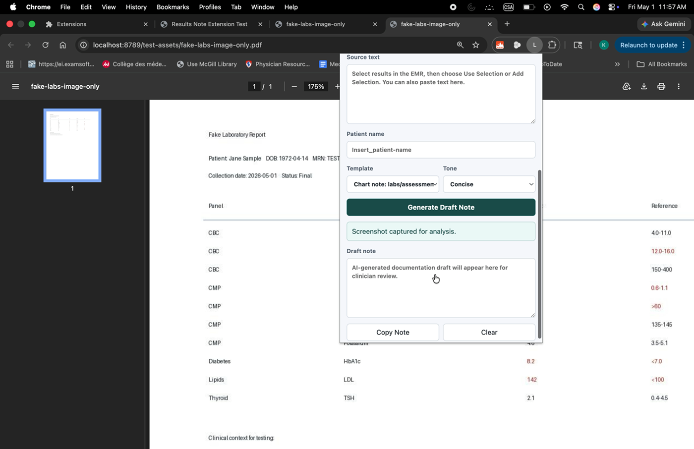

# Lab Note Draft Assistant

A Chrome/Edge extension that extracts clinical result text or screenshots from an EMR and drafts clinician-reviewable documentation with AI.

<p align="center">
  <a href="docs/media/demo-selection-workflow.mov">
    
  </a>
  <a href="docs/media/demo-screenshot-workflow.mov">
    
  </a>
</p>

<p align="center">
  <a href="docs/media/demo-selection-workflow.mov">Watch selection workflow</a>
  ·
  <a href="docs/media/demo-screenshot-workflow.mov">Watch screenshot workflow</a>
</p>

## Highlights

- Select multiple pieces of chart context, including PMH, meds, labs, and imaging.
- Capture or upload screenshots for image-based result analysis.
- Generate structured chart notes with `Labs reviewed` and `Imp and plan`.
- Keep drafts clinician-reviewable and easy to edit before charting.

## What it does

- Extracts highlighted text from the active EMR page.
- Can fall back to visible page text when selection is not available.
- Can capture or upload a screenshot/image for image-based result analysis.
- Supports multiple draft templates, starting with a chart note format for labs reviewed, assessment, and plan.
- Sends the lab text to either:
  - a configured OpenAI API key, or
  - an approved server-side proxy URL.
- Produces a draft note and review flags.
- Copies the final draft to the clipboard after clinician review.

The included demos should use fake or de-identified data only. Do not publish recordings that show real patient information.

## Privacy and clinical safety

Lab data is protected health information. Do not send PHI to any AI service unless your organization has approved that workflow, including security review, access controls, auditability, retention rules, and any required BAA/vendor agreement.

For real clinical use, prefer the proxy mode. A server-side proxy keeps API keys out of the browser, can enforce authentication, can redact or log according to policy, and can route requests only to approved AI services.

The generated note is documentation support only. It should be reviewed and edited by a licensed clinician before being placed in the chart.

## Install locally

1. Open Chrome or Edge.
2. Go to `chrome://extensions`.
3. Turn on Developer mode.
4. Choose **Load unpacked**.
5. Select this folder: `/Users/Kristinema/Documents/New project`.

## Configure

Open the extension popup and click the settings button.

- For quick local testing, enter an OpenAI API key and model.
- For clinical/production workflows, enter an approved proxy URL instead.

The extension currently defaults to `gpt-4.1` because the OpenAI Responses API examples support the Responses endpoint with model IDs. You can change the model in the popup without editing code.

## Optional local proxy

For a local proof of concept:

```sh
OPENAI_API_KEY=sk-your-key node examples/proxy-server.mjs
```

Then set the extension proxy URL to:

```text
http://localhost:8787/lab-note
```

You can also open a test page with fake lab data:

```text
http://localhost:8787/test
```

For production, restrict CORS to your extension ID or approved origin, add authentication, add audit logging according to policy, and deploy only in an approved environment.

## Proxy contract

If using a proxy URL, the extension sends:

```json
{
  "model": "gpt-4.1",
  "instructions": "system instructions string",
  "input": "JSON string containing note_style, tone, and lab_text"
}
```

The proxy should return one of:

```json
{
  "note": "Draft note text",
  "review_flags": ["Optional issue to review"]
}
```

or:

```json
{
  "output_text": "Draft note text"
}
```

## Suggested next steps

- Add EMR-specific extraction rules for your actual lab-result table markup.
- Add organization-approved authentication to proxy mode.
- Add a structured lab parser if your EMR exposes FHIR Observation resources.
- Add note templates for common workflows, such as normal result messages, abnormal follow-up, and chronic disease monitoring.
